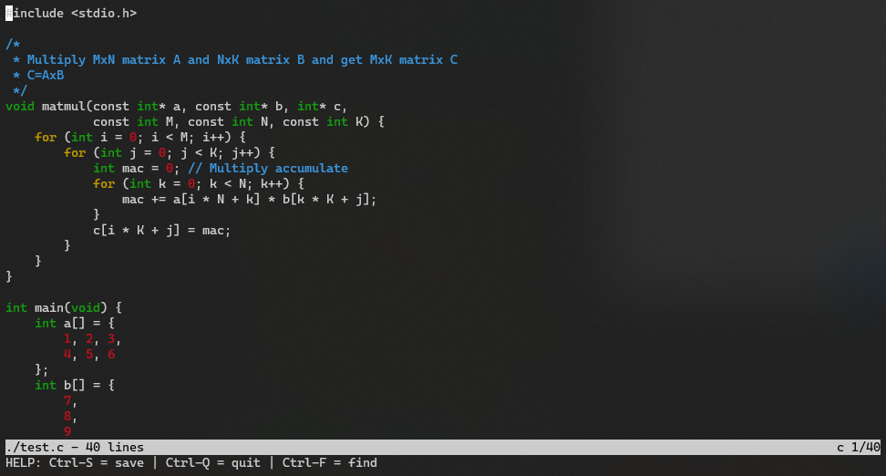

# build-my-own-text-editor

テキストエディタ "kilo" を作ってみる

- [Build Your Own Text Editor](https://viewsourcecode.org/snaptoken/kilo/): C言語で軽量テキストエディタを作成するチュートリアルガイド
- [antirez/kilo](https://github.com/antirez/kilo): テキストエディタ "kilo"



## Requirement

- gcc (C99)
- GNU Make
- POSIXライブラリ
    - `<fcntl.h>`
    - `<sys/ioctl.h>`
    - `<sys/types.h>`
    - `<termios.h>`
    - `<unistd.h>`

## Build

ビルド：

```sh
# build/release/kilo
$ make
```

デバッグビルド：

```sh
# build/debug/kilo
$ make DEBUG=yes
```

## Usage

```sh
$ kilo <filename>
```

## License

BSD2-Clause License
